## 线性表

 ### 案例

1. 一元多项式的运算

   用数组表示多项式

   $y=1+x^2$

   | 下标 | 0    | 1    |
   | ---- | ---- | ---- |
   | 系数 | 1    | 1    |

2. 稀疏多项式

   只需记录系数不为0的项

   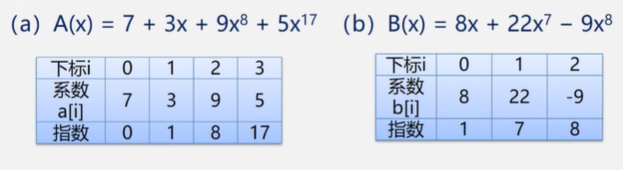

   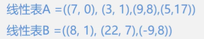

   > 运算
   >
   > 分别从头遍历比较A和B的每一项
   >
   > - 指数相同，对应系数相加，填入数组C中，同时去掉A和B中运算过的项
   > - 指数不相同，将小的项复制到C中
   >
   > 遍历完后，将剩余项填入C中

**链式存储结构**

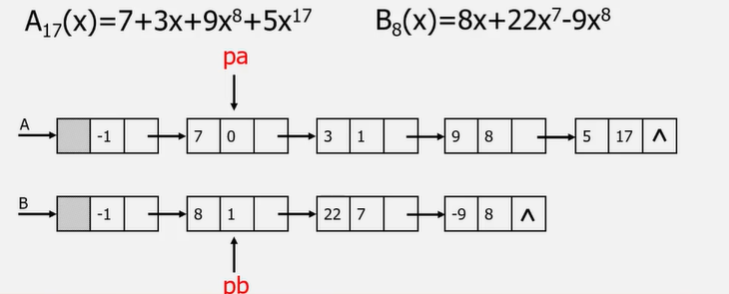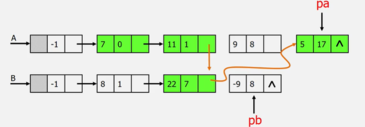


3. 图书信息管理系统

   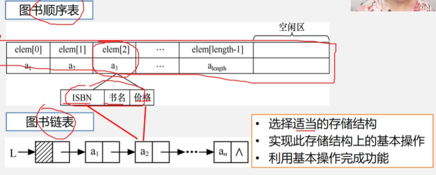

### 线性表的类型定义

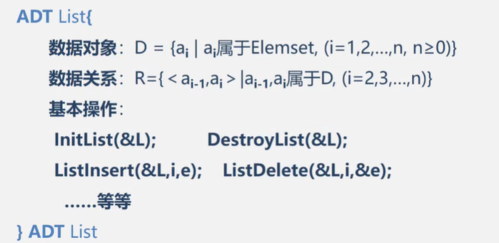


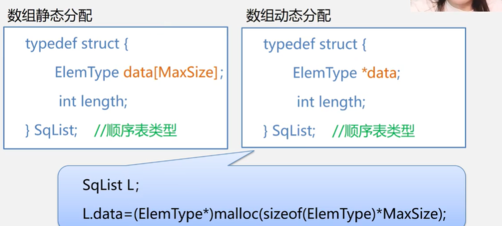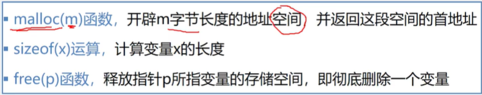


​					需要头文件<stdlib.h>


```c
#define LIST_INIT_SIZE 100 //线性表存储空间的初始分配量

typedef char/int/... ElemType
    
typedef struct{
    ElemType elem[LIST_INIT_SIZE];
    int length;//当前长度
}SqList;
```


定义  $线性表P=((p1,e1),(p2,e2),...,(pm,em))$

```c
#define MAXSIZE 100  //多项式可能达到的最大长度

typedef struct{
    float p;//系数
    int e;//指数
}Polynomial;//每一个数据项的类型  (pm,em)

typedef struct{
    Polynomial *elem;//存储空间的基地址
    int length;//多项式当前项的个数
}SqList;//多项式的顺序存储结构类型为SqList
```

定义图书表

```c
#define MAXSIZE 10000

//图书信息定义
typedef struct{
    char no[20];
    char name[50];
    float price;
}Book;

typedef struct{
    Book *elem;//图书表的空间基地址
    int length;//图书的个数
}SqList;//图书表的顺序存储结构类型
```


传参

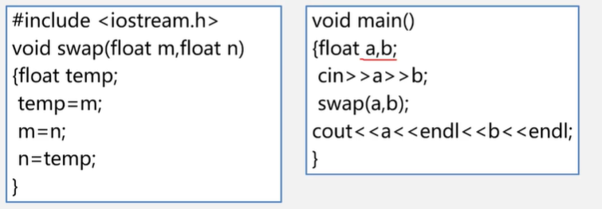

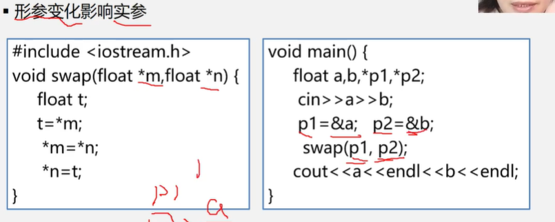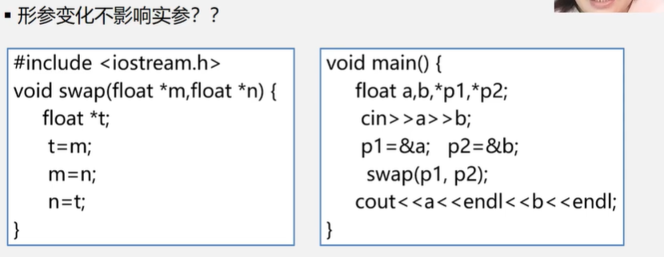

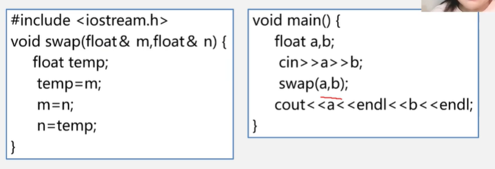


### 顺序表的操作

#### 线性表初始化

```c
#define OK 1
#define ERROR 0
...

Status InitList_Sq(SqList &L){//构造一个空的顺序表
    L.elem = new ElemType[MAXSIZE];//为顺序表分配空间
    if(!L.elem) exit(OVERFLOW);//存储分配失败
    L.length = 0;
    return OK;
}
```

#### 销毁线性表

```c
void DestroyList(SqList &L){
    if(L.elem) delete L.elem;//释放存储空间
}
```

#### 清空线性表

```c
void ClearList(SqList &L){
    L.length = 0;//将线性表的长度置为0
}
```

#### 求线性表长度

```c
int GetLength(SqList L){
    return L.length;
}
```

#### 判断线性表是否为空

```c
int IsEmpty(SqList L){
    if(L.length == 0) return 1;
    else return 0;
}
```

#### 顺序表的取值

```c
int GetElem(SqList L,int i,ElemType &e){
    if(i<1||i>L.length) return ERROR;
    e = L.elem[i-1];
    return OK;
}
```

#### 顺序表的查找

```c
int LocateElem(SqList L,ElemType e){
    for(i=0;i<L.length;i++){
        if(L.elem[i] == e) return i+1;//查找成果，返回序号
    return 0;//失败
    }
}
```

 平均查找长度 $(n+1)/2$

#### 顺序表的插入

```c
Status ListInsert_Sq(SqList &L,int i,ElemType e){
    if(i<1 || i>L.length+1) return ERROR;//i值不合法
    if(L.length == MAXSIZE) return ERROR;//存储空间已满
    for(j=L.length-1;j>=i-1;j--){
        L.elem[j+1] = L.elem[j];//插入位置及之后的元素后移
    }
    L.elem[i-1] = e;
    L.length++;
    return OK;
}
```

平均移动次数n/2

#### 顺序表的删除

```c
Status ListDelete_Sq(SqList &L,int i){
    if(i<1 || i>L.length) return ERROR;
    for(j=i;j<=L.length-1;j++){
        L.elem[j-1] = L.elem[j];
    }
    L.length--;
    return OK;
}
```

(n-1)/2


### 线性表的链式结构

线性表中数据元素在存储器中的位置是任意的，即逻辑上相邻的数据元素在物理位置上不一定相邻

顺序表：随机存取

链表：顺序存取

```c
typedef struct Lnode{//声明节点的类型和指向节点的指针类型
    ElemType data;//数据域
    struct Lnode *next;//指针域
}Lnode,*LinkList;//LinkList为指向结构体Lnode的指针类型

//定义链表
LinkList L;
Lnode *L;
//定义结点指针p
Lnode *p;
LinkList p;
```

### 单链表的基本操作

#### 单链表的初始化

生成新结点作头结点，用头指针L指向头结点

将头结点的指针域置为空

```c
Status InitList_L(LinkList &L){//L是引用型变量
    L = new Lnode;//L = (LinkList)malloc(sizeof(Lnode));
    L->next = NULL;
    return OK;
}
```

#### 判断链表是否为空

判断头结点的指针域是否为空

```c
int ListEmpty(LinkList L){//若L为空表，则返回0
    if(L->next){
        return 0;
    }else{
        return 1;
    }
}
```

#### 单链表的销毁

从头指针开始，一次释放所有节点

```c
Status DestroyList_L(LinkList &L){
    Lnode *p;
    while(L){
        p = L;//存储头结点
        L = L->next;//移动头结点
        delete p; //与new配套
        //free(p);//与malloc配套
    }
}
```

#### 清空链表

保留头结点和头指针，依次释放所有结点，头结点指针域置为空

```c
Status ClearList(LinkList &L){
    Lnode *p,*q;
    p = L->next;//首结点
    while(p){
        q = p->next;//p的下一个结点
        delete p;
        p = q;
    }
    L->next = NULL;
    return OK;
}
```

#### 求链表的表长

从首结点开始计算

```c
int ListLength(LinkList L){
    Lnode *p;
    p = L-next;//首结点
    i = 0;
    while(p){
        i++;
        p = p->next;//移动指针
    }
    return i;
}
```

#### 取单链表的第i个元素

```c
Status GetElem(LinkList L,int i,ElemType &e){
    p = L->next;//首结点
    j = 1;
    while(p && j<i){
        p = p->next;
        j++;
    }
    if(!p || j>i) return ERROR;//第i个元素不存在  0 -1 大于i
    e = p->data;
    return OK;
}
```

#### 按值查找

```c
Lnode *LocateElem(LinkList L,ElemType e){
    p = L->next;
    while(p && p->data!=e){//当p超出链表时或者找到时停止循环
        p = p->next;
    }
    return p;
}
```

#### 插入

```c
Status ListInsert(LinkList &L,int i,ElemType e){
    p = L;
    j = 0;
    while(p && j<i-1){//找i-1结点
        p = p->next;
        j++;
    }
    if(!p || j>i-1) return ERROR;//i非法（i大于表长+1或者小于1）
    s = new Lnode;
    s->data = e;
    s->next = p->next;
    p->next = s;//这两步不能交换，否则导致s->next = s
    return OK;
}
```

#### 单链表的建立

**头插法**

```c
void CreateList(LinkList &L,int n){
    L = new LNode;
    L->next = NULL;//建立带头结点的单链表
    for(i=n;i>0;i--){
        p = new LNode;//生成新结点
        cin>>p->data;
        p->next = L->next;
        L->next = p;
    }
}
```

**尾插法**

引入尾指针

```c
void CreateList(LinkList &L,int n){
    L = new Lnode;
    L->next = NULL;
    r = L;
    for(int i=0;i<n;i++){
        p = new Lnode;
        cin>>p->data;
        p->next = NULL;
        r->next = p;
        r = p;//移动尾指针
    }
}
```


### 循环链表

循环链表中没有NULL指针，判断是否为空的条件为：==判断p!=NULL==

用R表示尾指针，则首结点：R->next->next,尾结点：R

#### 合并带尾指针的循环链表

```c
LinkList Connect(LinkList Ta,LinkList Tb){
    p = Ta->next;//保存头结点（操作过程中有结点丢失）
    Ta->next = Tb->next->next;//Tb表头连接Ta表尾
    delete Tb->next;
    Tb->next = p;
    return Tb;
}
```

### 双向链表

定义

```c
typedef struct DuLNode{
    ElemType data;
    struct DuLnode *prior,*next;
}DuLNode,*DuLinkList;
```

#### 插入

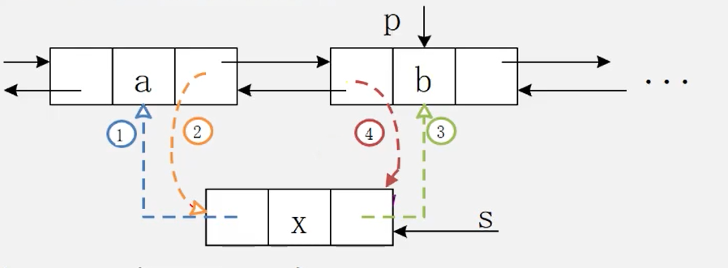

```c
void ListInsert(DuLinkList &L,int i,ElemType e){
    if(!(p=GetElemP(L,i))) return ERROR;
    s = New DuLNode;
    s->data = e;
    s->prior = p->prior;
    p->prior->next = s;
    s->next = p;
    p->prior = s;
    return OK;
}
```

#### 删除

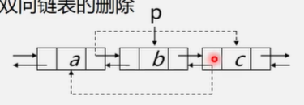

```c
void ListDelete(DuLinkList &L,int i,ElemType &e){
    if(!(p=GetElemP(L,i))) return ERROR;
    e = p->data;
    p->prior->next = p->next;
    p->next->prior = p->prior;
    free(p);
    return OK;
}
```


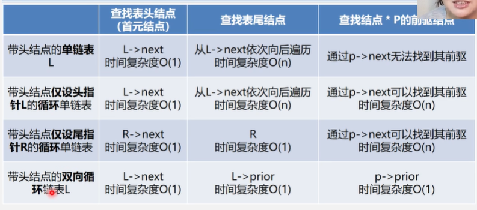


## 应用

### 线性表的合并

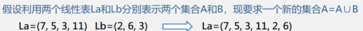

依次从Lb中取出每个元素，看是否存在于La中

```c
void union(List &La,List Lb){
    La_len = ListLength(La);
    Lb_len = ListLength(Lb);
    for(i=1;i<Lb_len;i++){
        GetElem(Lb,i,e);//取链表的第i个元素并赋值给e
        if(!LocateElem(La,e)){//La中是否有e
            ListInsert(&La,La_len++,e);//没有则插入La中
        }
    }
}
```

$O(n^2)$

### 有序表的合并

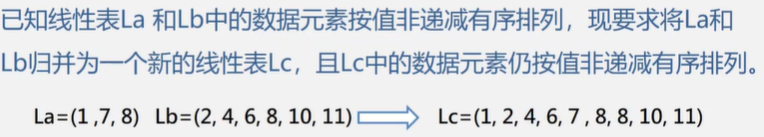

把小的元素放入新的表中

#### 顺序表实现

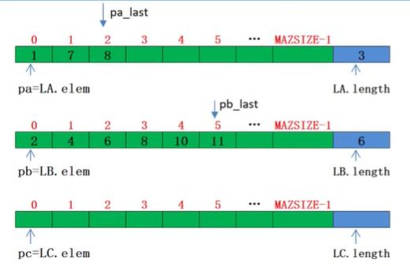

```c
void MergeList(SqList LA,SqList LB,SqList &LC){
    pa = LA.elem;
    pb = LB.elem; //pa和pb的初值指向两个表的第一个元素
    LC.length = LA.length + LB.length;//新表长度为待合并的表的长度之和
    LC.elem = new ElemType[LC.length];//为新表分配数组空间
    pc = LC.elem;
    pa_last = LA.elem + LA.length - 1;//pa_last指向LA表的最后一个元素
    pb_last = LB.elem + LB.length - 1;
    while(pa<=pa_last && pb<=pb_last){//两个表都非空
        if(*pa <= pb){
            *pc++ = *pa++;//先赋值再+1,即pa
        }else{
            *pc++ = *pb++;
        }
    }
    //将剩余元素加入LC
    while(pa <= pa_last) *pc++ = *pa++;
    while(pb <= pb_last) *pc++ = *pb++;
}
```

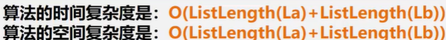

#### 用链表实现

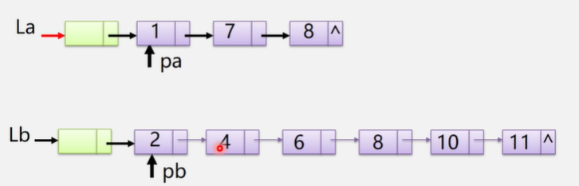

```c
//
void MergeList(LinkList &La,LinkList &Lb,LinkList &Lc){
    pa = La->next;
    pb = Lb->next;//指向首结点
    pc = Lc = La;//用La的头结点作为Lc的头结点
    while(pa && pb){
        if(pa->data <= pb->data){
            pc->next = pa;
            pc = pa;
            pa = pa->next;
        }else{
            pc->next = pb;
            pc = pb;
            pb = pb->next;
        }
    }
    //插入剩余段
    pc->next = pa?pa:pb;//将剩下的（即不为空的链表接入Lc）
    delete Lb;
}
```

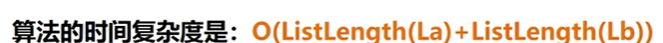

把所有元素都比较一遍，把a和b的元素都要一个一个的加进去

### 案例

#### 一元多项式的运算

顺序表实现

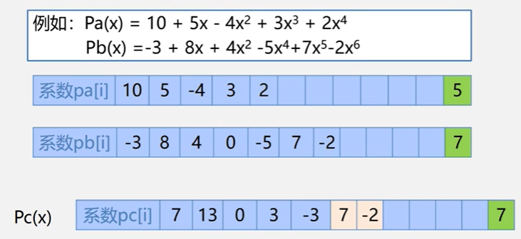

对应项的系数相加，存储在一个新的顺序表中。

#### 稀疏多项式运算

顺序表实现


​				C的大小不好确定，空间复杂度高

链表

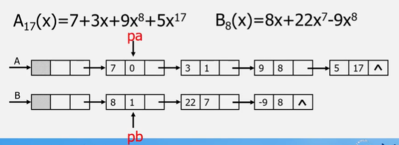

```c
typedef struct PNode{
    float coef;//系数
    int expn;//指数
    struct PNode *next;//指针域
}PNode,*Polynomial;

//多项式建立
void CreatePolyn(Polynomial &P,int n){
    //建立一个带头结点的单链表
    P = new PNode;
    P->next = NULL;
    
    //依次输入每个项
    for(i=1;i<=n;i++){
        s = new PNode;//新结点
        cin>>s->ceof>>s->expn;;//输入系数和指数
        pre = P;//pre用于保存q的前驱，初始为头结点，pre用于指向待找到的第一个大于输入项指数的结点的前驱
        q = P-next;//第一个大于输入项指数的结点
                
        while(q && q->expn < s->expn){//找到第一个大于输入指数的项*q
            pre = q;
            q = q->next;
        }
        //插入
        s->next = q;
        pre->next = s;
    }
}

//多项式相加
//指针p1和p2初始化，分别指向Pa和Pb的首元结点
//p3指向和多项式的当前结点，初值为Pa的头结点
//p->expn == p2->expn时，和不为0则修改p1所指结点的系数值，为0则删除结点
//剩余结点
```

#### 图书信息管理系统

```c
struct Book{
    char id[20];
    char name[50];
    int price;
}
//顺序表
typedef struct{
    Book *elem;
    int length;
}SqList;
//链表
typedef struct LNode{
    Book data;
    struct LNode *next;
}LNode,*LinkList;
```


