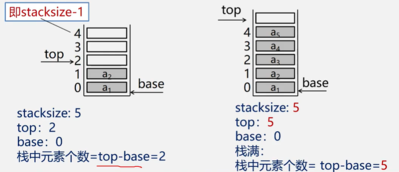
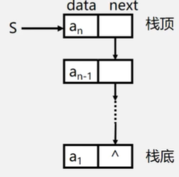
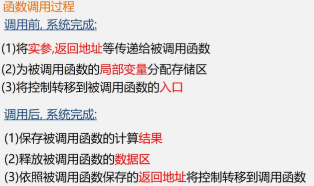
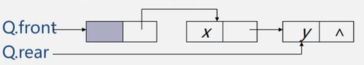

## 栈和队列的定义和特点

栈和队列是限定插入和删除只能在表的顶端进行的==线性表==

栈——先进后出

队列——先进先出

### 栈

定义：限定在栈顶进行操作的线性表

逻辑结构：与同线性表相同，存在前驱和后继，为一对一的关系

存储关系：可以用顺序栈和链栈存储

### 队列

定义：头删尾插

逻辑结构：与同线性表相同，一对一

存储结构：顺序队或者链队

## 案例引入

### 栈

#### 进制转换

把十进制数159转换成八进制数

转换规则：除以d倒取余，商数除以d倒取余

159=8*19+7

19=8*2+3

2=0*8+3

=>237

#### 括号匹配的检验

#### 表达式求值

### 顺序栈的表示和操作

top指针：指示栈顶元素在顺序栈中的位置，为了操作方便，通常top指示真正的栈顶元素之上（下一个元素）的下标地址

base指针：知识栈底元素在顺序栈中的位置

栈空标志 ==base == top==

栈满 ==top-base == stacksize==

#### 表示

```c
#define MAXSIZE 100
typedef struct{
    SElemType *base;//栈底指针
    SElemType *top;//栈顶指针
    int stacksize;//栈可用最大容量
}SqStack;
```



top+1则表示top的下一个元素

#### 初始化

```c
Status InitStack(SqStack &S){
    S.base = new SElemType(MAXSIZE);
    //S.base = (SElemType*)malloc(MAXSIZE*sizeof(SElemType));
    if(!S.base) exit(OVERFLOW);//分配失败
    S.top = S.base;//栈顶指针等于栈底指针
    S.stacksize = MAXSIZE;
    return OK;
}
```

#### 判断栈是否为空

```c
Status StackEmpty(SqStack S){
    if(S.top == S.base){
        return TRUE;//空
    }else{
        return FALSE;
    }
}
```

#### 顺序栈长度

```c
int StackLength(SqStack S){
    return S.top - S.base;
}
```

#### 清空顺序栈

```c
Status ClearStack(SqStack S){
    if(S.base) S.top = S.base;//不为空则清空
    return OK;
}
```

#### 销毁顺序栈

```c
Status DestroyStack(SqStack &S){
    if(S.base){
        delete S.base;//删除栈底（delete的作用是释放指针内存）
        S.stacksize = 0;
        s.base = s.top = NULL;//（删除地址）
    }
    return OK;
}
```

#### 入栈

```c
Status Push(SqStack &S,SElemType e){
    if(S.top -S.base == S.stacksize)//栈满
        return ERROR;
    *S.top++ = e;//*S.top = e;S.top++;
    return OK;
}
```

#### 出栈

```c
Status Pop(SqStack &S,SElemType &e){
    if(S.top == S.base){//栈空 StackEmpty(S)
        return ERROR;
    }
    e = *--S.top;//--S.top;//e = *S.top;
    return OK;
}
```

### 链栈的表示和实现

只能在链表头部进行操作

#### 表示

```c
typedef struct StackNode{
    SElemType data;
    struct StackNode *next;
}StackNode,*LinkStack;
LinkStack S;
```



注意指针方向，后继结点指向前驱结点

链表的头指针就是栈顶

不需要头结点

#### 初始化

```c
void InitStack(LinkStack &S){
    S = NULL;//只需要头指针
    return OK;
}
```

#### 是否为空

```c
Status StackEmpty(LinkStack S){
    if(S == NULL) return TRUE;
    else return FALSE;
}
```

#### 入栈

```c
Status Push(LinkStack &S,SElemType e){
    p = new StackNode;
    p->data = e;
    p->next = S;
    S = p;
    return OK;
}
```

#### 出栈

```c
Status Pop(LinkStack &S,SElemType &e){
    if(S == NULL) return ERROR;
    e = S->data;
    p = S;
    S = S->next;
    delete p;
    return OK;
}
```

#### 取栈顶元素

```c
SElemType GetTop(LinkStack S){
	if(S != NULL){
        return S->data;
    }
}
```

### 栈与递归



## 队列

### 顺序队列的表示和操作

#### 表示

用一维数组base

```c
#define MAXQSIZE 100
typedef struct{
    QElemType *base;//指向数组的基地址,数组的地址是一个指针
    int front;//头指针
    int rear;//尾指针
}SqQueue;
```

存在假溢出的情况=>引入循环队列

少用一个元素空间

队空 `front == rear`

队满 `(rear+1)%MAXQSIZE == front`

#### 初始化

```c
Status InitQueue(SqQueue &Q){
    Q.base = new QElemmType[MAXQSIZE]; //普通类型引用成员用点
    if(!Q.base) exit(OVERFLOW);
    Q.front = Q.rear = 0;
    return OK;
}
```

#### 长度

```c
int QueueLength(SqQueue Q){
    return (Q.rear - Q.front + MAXQSIZE)%MAXQSIZE;
}
```

#### 入队

```c
Status EnQueue(SqQueue &Q,QElemType e){
    if((Q.rear+1)%MAXQSIZE == Q.front) return ERROR;//队满
    Q.base[Q.rear] = e;//放在尾指针下标处
    Q.rear = (Q.rear + 1)%MAXQSIZE;
    return OK;
}
```

#### 出队

```c
Status EnQueue(SqQueue &Q,QElemType &e){
    if(Q.front == Q.rear) return ERROT;//队空
    e = Q.base[Q.front];//对头元素
    Q.front = (Q.front+1)%MAXQSIZE;
    return OK;
}
```

#### 取队头

```c
QElemType GetHead(SqQueue Q){
    if(Q.front != Q.rear){
        return Q.base[Q.front];
    }
}
```

### 链队的表示和实现

```c
#define MAXQSIZE 100F
typedef struct Qnode{
    QElemtype data;
    struct Qnode *next;
}QNode,*QueuePtr;

typedef struct{
    QueuePtr front;//头指针
    QueuePtr rear;//F尾指针
}LinkQueue;
```



#### 初始化

```c
Status InitQueue(LinkQueue &Q){
    Q.front = Q.rear = (QueuePtr)malloc(sizeof(QNode));
    if(!Q.front) exit(OVERFLOW);
    Q.front->next = NULL;//Q是普通类型，Q.front是指针类型
    return OK;
}
```

#### 销毁

从头结点开始，依次释放所有结点

```c
Status DestroyQueue(LinkQueue &Q){
    while(Q.front){
        p = Q.front->next;
        free(Q.front);
        Q.front = p;
    }
    return OK;
}
```

#### 入队

```c
Status EnQueue(LinkQueue &Q,QElemType e){
    p = (QueuePtr)malloc(sizeof(QNode));
    if(!p) exit(OVERFLOW);
    p->data = e;
    p->next = NULL;
    Q.rear->next = p;
    Q.rear = p;
    return OK;
}
```

#### 出栈

```c
Status Queue(LinkQueue &Q,QElemType &e){
    if(Q.front == Q.rear) return ERROR;
    p = Q.front->next;//出队结点
    e = p->data;
    Q.front->next = p->next;//移动头结点
    if(Q.rear == p) Q.rear = Q.front;//删除的恰好是尾结点，删除之后头指针和尾指针一样
    delete p;
    return OK;
}
```

