## 串

定义：零个或多个任意字符组成的有限序列

子串：串中任意个连续字符串组成的子序列

空格串：有一个或多个空格组成的串，与空串不同

串相等：当且仅当两个串的长度相等并且各个对应位置上的字符都相同

所有空串都相等

### 串的类型定义、存储结构及运算

逻辑结构：线性结构

存储结构：顺序、链式

顺序

```c
#define MAXLEN 255
typedef struct{
    char ch[MAXLEN+1];//0~255，0号位置可以不用
    int length;//串的当前长度
}SString;
```

链式(存储密度低)

将多个字符放在一个结点中提高存储密度——块链

```c
#define CHUNKSIZE 80//块的大小
typedef struct Chunk{
    char ch[CHUNKSIZE];
    struct Chunk *next;
}Chunk;
typedef struct{
    Chunk *head,*tail;//头指针、尾指针
    int curlen;//串的当前长度
}LString;
```

### 传的模式匹配算法

确定出主串中所含字串第一次出现的位置

算法：BF（暴力法）、KMP

#### BF

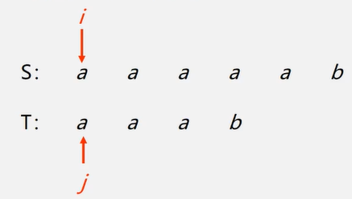

> BF
>
> 将主串中的第pos个字符和模式串中的第一个字符比较
>
> - 若相等，继续逐个比较后续字符
> - 若不等，从主串的下一字符起，重新与模式串的第一个字符比较
>   - 直到主串的一个连续子串字符序列与模式串相等。
>   - 主串指针回溯：==i=i-j+2==

```c
int Index_BF(SString S,SString T){
    int i = 1,j = 1;
    //循环结束条件：比较完S也找不到；已经匹配到T的长度，即找到了子串
    while(i<=S.length && j<=T.length){
        if(S.ch[i] == T.ch[j]){
            i++;
        	j++;
        }else{
            i = i-j+2;
            j = 1;
        }
    }
    if(j > T.length){//要加上这个条件，因为跳出循环可能是因为S中没有T,此时j比较小
        return i-T.length;
    }
}
```

时间复杂度`n*m`

#### KMP

主串指针不用回溯

定义next[j]函数，表明当模式中第j个字符与主串中相应字符失配时，在模式中需重新和主串中该字符进行比较的字符的位置

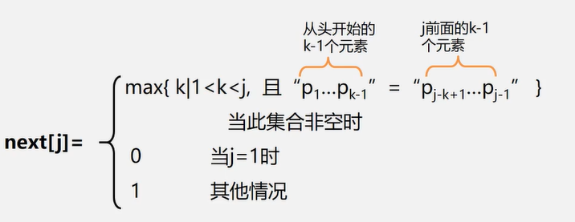

当前缀=后缀并且为最长时取max（不包括本身）

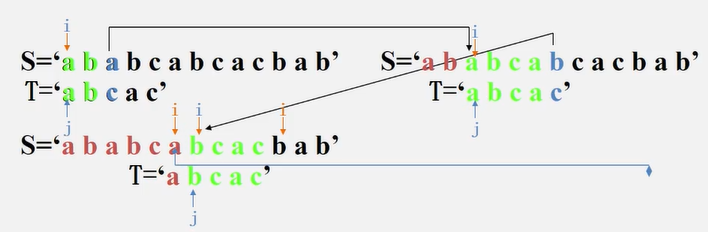

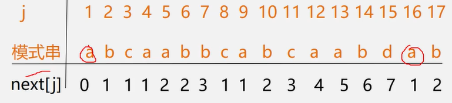

 ```c
int Index_KMP(SString S,SString T,int pos){
    int i = pos,j = 1;
    //因为i不需要回溯，所以i、j等于length时跳出循环
    //j等于length时则模式串已经匹配完了（可能成功可能失败），跳出循环
    //i等于length时同理
    while(i<S.length && j<T.length){
        //j==0时，模式串的第一个字符就匹配不上，需要后移
        if(j==0 || S.ch[i]==T.ch[j]){
            i++;
            j++;
        }else{
            j = next[j];//i不变，j后退
        }
        if(j > T.length)
            return i-T.length;
        else return 0;
    }
}
 ```

时间复杂度：`O(m+n)`

## 数组

### 数组的顺序存储

一维数组的地址：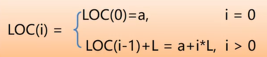

二维数组的地址：行优先：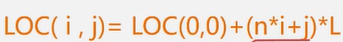；

### 特殊矩阵的压缩存储

1. 对称矩阵

   只存储下（或者上）三角（包括主对角线）的数据元素。共占用n(n+1)/2个元素空间

   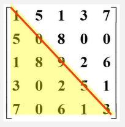

   以行序为主序存储下三角

   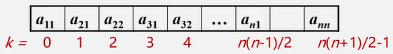

2. 三角矩阵

   对角线以下（或者以上）的数据元素（不包括对角线）全部为常数c

   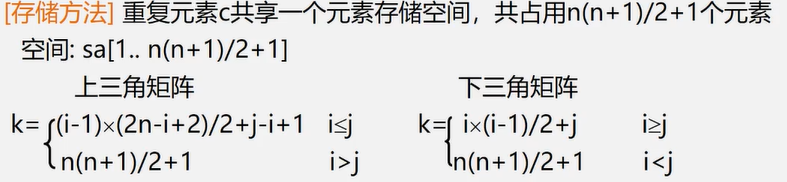

3. 对角矩阵

   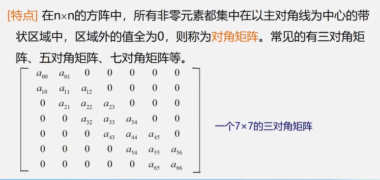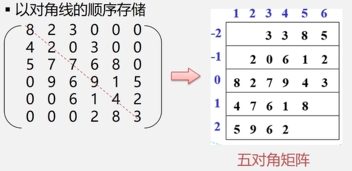

   

### 稀疏矩阵存储

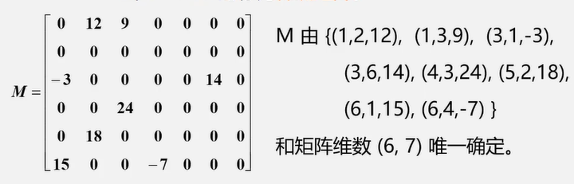

1. 三元组顺序表

   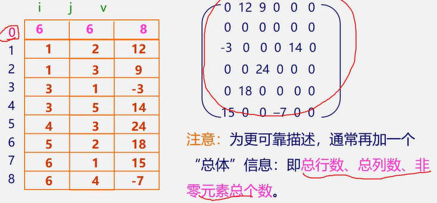

   不能随机存取。若按行号取某一行中的非零元，则需从头开始进行查找

2. 链式存储

   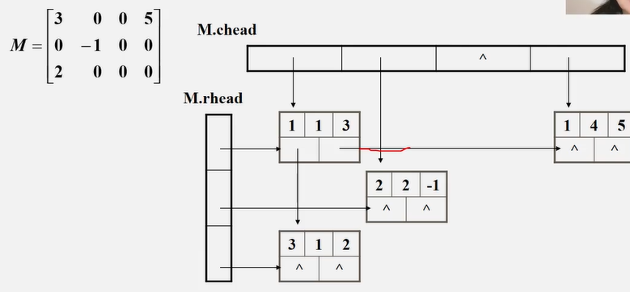

   十字链表：chead指向每一列的第一个非零元，rhead指向每一行的第一个非零元。每个结点一个指针指向这一行的下一个非零元，另一个指针指向这一列的下一个非零元。

## 广义表

元素的类型可以不一样，每一项也可以是一个广义表也可以是原子

表头：若广义表非空，则其第一个元素就是表头。可以是原子也可以是子表。

表尾：除表头之外的其他元素组成的表。是一个子表。

- 广义表中的数据元素有相对次序

- 广义表的长度定义为最外层所包含元素的个数

- 广义表的深度定义为该广义表展开后所含括号的重数

  原子的深度为0；空表的深度为1