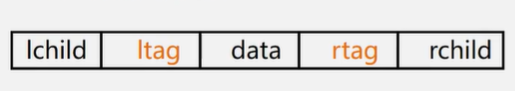
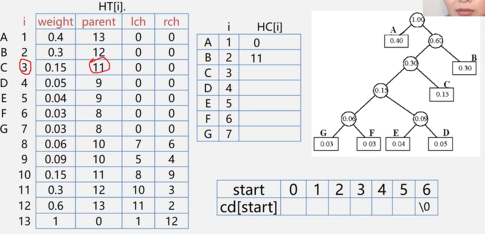

## 树和二叉树

### 二叉树的性质和存储结构


#### 满二叉树

除了叶子外，每个结点都有2个结点


#### 完全二叉树

深度为k的具有n个结点的二叉树，当且仅当其每一个结点都与深度为k的满二叉树中编号为1~n的结点一一对应时，称为完全二叉树


在满二叉树中，从最后一个结点开始，==连续==去掉任意个结点，就是一棵完全二叉树

- 叶子只可能分布在层次最大的两层上
- 对任一结点，如果其右子树的最大层次为i，则其左子树的最大层次必为i或i+1

### 二叉树的存储结构

##### 顺序

按满二叉树的结点层次编号，依次存放二叉树中的数据元素

```c
#define MAXSIZE 100
typedef TElemType SqBiTree[MAXSIZE];
SqBiTree bt;
```


缺点：存储单支树存储密度小，适用于满二叉树和完全二叉树

##### 链式

```c
typedef struct BiNode{
    TElemType data;
    struct BiNode *lchild,*rchild;
}BiNode,*BiTree;
```


## 遍历二叉树

### 递归

- 先序遍历

  ```c
  Status PreOrderTraverse(BiTree T){
      if(T == NULL){//空二叉树
          return OK;
      }else{
          visit(T);//访问根结点
          PreOrderTraverse(T->lchild);//递归遍历左子树
          PreOrderTraverse(T->rchild);//递归遍历右子树
      }
  }
  ```

- 中序遍历

  ```c
  Status InOrderTraverse(BiTree T){
      if(T == NULL){
          return OK;
      }else{
          PreOrderTraverse(T->lchild);//递归遍历左子树
          visit(T);//访问根结点
          PreOrderTraverse(T->rchild);//递归遍历右子树
      }
  }
  ```

- 后序遍历

  ```c
  Status PostOrderTraverse(BiTree T){
      if(T == NULL){
          return OK;
      }else{
          PreOrderTraverse(T->lchild);//递归遍历左子树
          PreOrderTraverse(T->rchild);//递归遍历右子树
          visit(T);//访问根结点
      }
  }
  ```


每个结点都经过三次：出发一次；访问完左子树回来经过一次；访问完右子树回来经过一次

时间复杂度：O(n)

空间复杂度：O(n),最坏的情况是单支数，第一次路过节点的时候不访问，先存进栈

### 非递归

- 中序遍历

  建立一个栈，根结点进栈，遍历左子树；根结点出栈，输出根结点，遍历右子树。

  

  A入栈不访问，B入栈，访问左子树为空，B出栈，D入栈，访问左子树为空，D出栈，访问右子树为空，A出栈，C入栈，访问左子树为空，C出栈，访问右子树为空。

  ```c
  Status InOrderTraverse(BiTree T){
      BiTree p;//当前操作的结点
      InitStack(S);
      p = T;//初值为根结点
      while(p || !StackEmpty(S)){
  		if(p){
              Push(p,S);//p入栈
              q = p;
              p = p->lchild;//访问左子树
          }else{
              Pop(S,q);//根结点出栈
              printf("%c",q->data);
              p = q->rchild;//访问右子树
          }
      }
      return OK;
  }
  ```

### 二叉树的层次遍历

使用队列

- 将根结点入队
- 队不空时循环：从队列中出队一个结点*p，访问它；
  - 若他有左孩子结点，将左孩子结点入队
  - 若他有右孩子结点，将右孩子入队


`a入队，a出队；b、f入队（bf）；b出队，c、d入队（fcd）；f出队，g入队（cdg）；c出队（dg）；d出队，e入队（ge）；g出队，h入队（eh）；e、h出队。`

```c
typedef struct{
    BTNode data[MAXSIZE];//存放队中元素
    int front,rear;//队头和队尾下标
}SqQueue;

void LevelOrder(BTNode *b){
    BTNode *p;
    SqQueue *qu;
    InitQueue(qu);
    enQueue(qu,b);//根结点指针进入队列
    while(!QueueEmpty(qu)){
        deQueue(qu,p);
        printf("%c",p->data);//访问结点p
        if(p->lchild != NULL){
            enQueue(qu,p->lchild);
        }
        if(p->rchild != NULL){
            enQueue(qu,p->rchild);
        }
    }
}
```

### 应用

#### 按先序遍历建立二叉树的二叉链表

从键盘输入二叉树的结点，建立二叉树的存储结构；在建立二叉树的过程中按照二叉树先序建立


```c
Status CreateBiTree(BiTree &T){
    scanf(&ch);
    if(ch == "#") T = NULL;
    else{
        if(!(T = (BiTNode*)malloc(sizeof(BiTNode)))) exit(OVERFLOW);//根结点
        T->data = ch;
        CreateBiTree(T->lchild);//构造左子树
        CreateBiTree(T->rchild);//构造右子树
    }
    return OK;
}
```

#### 复制二叉树

- 如果时空树，递归结束
- 否则，申请新结点空间，复制根结点
  - 递归复制左子树
  - 递归复制右子树

```c
int Copy(BiTree T,BiTree &NewT){
    if(T == NULL){
        NewT = NULL;
        return 0;
    }else{
        NewT = new BiTNode;
        NewT->data = T->data;
        Copy(T->lchild,NewT->lchild);
        Copy(T->rchild,NewT->rchild);
    }
}
```

#### 计算二叉树的深度

- 如果时空树则深度为0
- 递归计算左子树的深度记为m，递归计算右子树的深度记为n，二叉树的深度则为MAX(m,n)+1

```c
int Depth(BiTree T){
    if(T == NULL){
        return 0;
    }else{
        m = Depth(T->lchild);
        n = Depth(T->rchild);
        if(m>n) return m+1;
        else return n+1;
    }
}
```

#### 计算二叉树结点总数

- 如果时空树，则结点个数为0
- 否则，结点个数为左子树个数+右子树个数+1

```c
int NodeCount(BiTree T){
    if(T == NULL){
        return 0;
    }else{
        m = NodeCount(T->lchild);
        n = NodeCount(T->rchild);
        return m+n+1;
    }
}
```

#### 计算叶子结点的个数

```c
int LeafCount(BiTree T){
    if(T == NULL){
        return 0;
    }
    if(T->lchild == NULL && T->rchild == NULL){
        return 1;
    }else{
        return LeafCount(T->lchild) + LeafCount(T->rchild);
    }
}
```

## 线索二叉树

当用二叉链表作为二叉树的存储结构时，可以很方便的找到某个结点的左右孩子；但一般情况下，无法直接找到该结点在某种遍历序列的前驱和后继结点。

- 如果某个结点的左孩子为空，则将空的左孩子指针域改为指向其前驱
- 如果某个结点的右孩子为空，则将空的右孩子指针域改为指向其后继


这种情况下，分不清指针到底指的是前驱后继或是孩子

对二叉链表中每个结点增设两个标志域ltag和rtag

- ltag=0，lchild指向该结点的左孩子
- ltag=1，lchild指向该结点的前驱
- rtag=0，rchild指向该结点的右孩子
- rtag=1，rchild指向该结点的后继



```c
typedef struct BiThrNode{
    int data;
    int ltag,rtag;
    struct BiThrNode *lchild,rchild;
}BiThrNode,*BiThrTree;
```


可能会有没有用到的结点，增设一个头结点：ltag=0，lchild指向根结点；rtag=1，rchild指向遍历序列中最后一个结点；遍历序列中第一个结点的lchild与和最后一个结点的rchild都指向头结点

## 树和森林

森林：是m(≥)棵互不相交的树的集合

### 树的存储结构

- 双亲表示法

  

  找双亲容易，找孩子难

  ```c
  typedef struct PTNode{
      TElemType data;
      int parent;//双亲的位置域
  }PTNode;
  
  #define MAXSIZE 100
  typedef struct{
      PTNode nodes[MAXSIZE];
      int r,n;//根结点的位置和结点个数
  }PTree;
  ```

- 孩子链表

  找孩子容易，找双亲难

  

  孩子结点结构

  ```c
  typedef struct CTNode{
      int child;
      struct CTNode *next;
  }*ChildPtr;
  ```

  双亲结点结构

  ```c
  typedef struct{
      TElemType data;
      ChildPtr firstchild;//孩子链表头指针
  }CTBox;
  ```

  树结构

  ```c
  typedef struct{
      CTBox node[MAXSIZE];
      int n,r;//结点数和根结点的位置
  }
  ```

- 带双亲的孩子链表

  

  既可以找双亲又可以找孩子

- 孩子兄弟表示法

  用二叉链表作树的存储结构，链表中的每个结点的两个指针域分别指向其第一个孩子结点和下一个兄弟结点

  ```c
  typedef struct CSNode{
      ElemType data;
      struct CSNode *firstchild,*nextsibling;
  }CSNode,*CSTree;
  ```

  

### 树与二叉树的转换

#### 树转换成二叉树

==兄弟相连留长子==

- 加线：在兄弟之间加一条线
- 抹线：对每个结点，除了其左孩子外，去除其与其余孩子之间的关系

#### 二叉树转换成树

==左孩右右连双亲，去掉原来右孩线==

- 加线：若p结点是双亲结点的左孩子，则将p的右孩子，右孩子的右孩子...沿分支找到的所有右孩子，都与p的双亲用线连起来
- 抹线：抹掉原二叉树中双亲与右孩子之间的连线

### 森林与二叉树的转换

#### 森林转换成二叉树

==树变二叉根相连==

- 将各棵树分别转换成二叉树
- 将每棵树的根结点用线相连
- 以第一棵树根结点为二叉树的根，再以根结点为轴心，顺时针旋转，构成二叉树结构

#### 二叉树转换成森林

==去掉全部右孩线，孤立二叉再还原==

- 抹线：将二叉树中根结点与其右孩子连线，及沿右分支搜索到的所有有右孩子间连线全部抹掉
- 还原：将孤立的二叉树还原成树

### 树的遍历

- 先根遍历
- 后根遍历
- 层次遍历

### 森林的遍历

将森林看作三部分构成

1. 森林中第一棵树的根结点

2. 森林中第一棵树的子树森林

3. 森林中其他树构成的森林

   

- 先序遍历：依次从左至右对森林中的每一棵树进行先根遍历
  - 访问森林中第一棵树的根结点
  - 先序遍历森林中第一棵树的子树森林
  - 先序遍历森林中其余树构成的森林

- 中序遍历：依次从左至右对森林中的每一棵树进行后根遍历
  - 中序遍历森林中第一棵树的子树森林
  - 访问森林中第一棵树的根结点
  - 中序遍历森林中其余树构成的森林

## 哈夫曼树

最优二叉树  带权路径最短的二叉树

### 哈夫曼树构造算法的实现

顺序存储结构

```c
typedef struct{
    int weight;
    int parent,lchild,rchild;
}HTNode,*HuffmanTree;
```


```c
void CreateHuffmanTree(HuffmanTree HT,int n){
    if(n <= 1) return;
    m = 2*n-1;//HuffmanTree树的结点个数
    HT = new HTNode[m+1];//申请m个结点大小的空间 0号单元未用，HT[m]表示根结点
    //初始化
    for(i=1;i<=m;i++){
        HT[i].lchild = 0;
        HT[i].rchild = 0;
        HT[i].parent = 0;
    }
    for(i=0;i<=n;i++){
        cin>>HT[i].weight;//输入权重值
    }
    //合并的次数就是除了叶子结点的个数
    for(i=n+1;i<=m;i++){
        Select(HT,i-1,s1,s2);//选择两个双亲域为0，且权值最小的结点
        //删除s1、s2，即他们的双亲结点不为0
        HT[s1].parent = i;
        HT[s2].parent = i;
        //产生新的结点
        HT[i].lchild = s1;
        HT[i].rchild = s2;
        //i的全职为左右孩子权值之和
        HT[i].weight = HT[s1].weigth + HT[s2].weight;
    }
}
```

### 哈夫曼编码算法实现



找某个结点的编码：查找他的双亲结点的下标，根据下标找到该双亲结点，看看这个结点是该双亲结点的左孩子还是右孩子，然后又重复以上操作，找该双亲结点的双亲结点

```c
void CreateHuffmanCode(HuffmanTree HT,HuffmanCode &HC,int n){
    HC = new char *[n+1];//分配n个字符编码的头指针矢量
    cd = new char [n];//分配临时存放编码的动态数组空间
    cd[n-1] = '\0';
    for(i=1;i<=0;i++){
        start = n-1;
        c = i;//下标
        f = HT[i].parent;
        while(f != 0){//从叶子结点开始向上回溯，直到根结点
            start--;//回溯一次start向前指一个位置  n-1处存放了\0
            if(HT[f].lchild == c){
                cd[start] = '0';//结点c是f的左孩子，则生成代码0
            }else{
                cd[start] = '1';//结点c是f的右孩子，则生成代码1
            }
            c = f;//下一个双亲结点
            f = HT[f].parent;//继续向上回溯
        }
        HC[i] = new char [n-start];//为第i个字符串编码分配空间 01是倒着存放进HC的
        strcpy(HC[i],&cd[start]);//将求得的编码从临时空间cd复制到HC的当前行中
    }
    delete cd;//释放临时空间
}
```