## 图的存储结构

图的逻辑结构：多对多

### 邻接矩阵

#### 几种结构

数组表示法

建立一个顶点表记录各个顶点信息，一个邻接矩阵表示顶点之间的关系

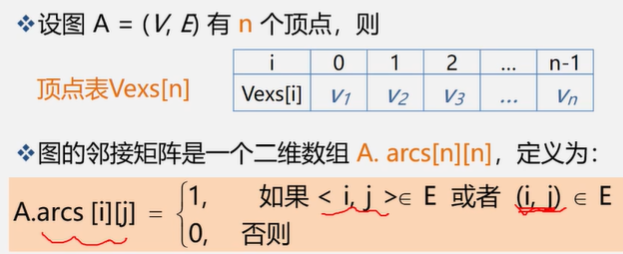

##### 无向图的邻接矩阵表示法

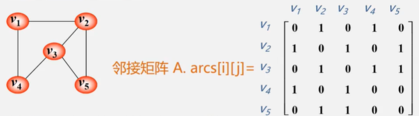

- 无向图的邻接矩阵是对称的
- 顶点i的度=第i行（列）中1的个数

##### 有向图的邻接矩阵

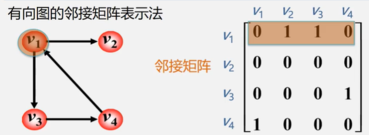

- 有向图的邻接矩阵可能是不对称的

- 顶点的出度=第i行元素之和

  顶点的入度=第i列元素之和

  顶点的度=第i行元素之和+第i列元素之和

##### 有权图（网）的邻接矩阵

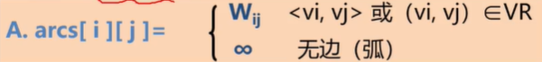

#### 邻接矩阵的存储表示

用两个数组分别存储顶点表和邻接矩阵表

```c
#define MVNum 100 //最大顶点数
typedef char VerTexType;//设顶点的数据类型为字符型
typedef int ArcType;//假设边的权值类型为整型

typedef struct{
    VerTexType vexs[MVNum];//顶点表
    ArcType arc[MVNum][MVNum];//邻接矩阵
}AMGraph;
```

#### 采用邻接矩阵表示法创建无向网

- 输入总顶点数和总边数
- 依次输入点的信息存入顶点表中
- 初始化邻接矩阵，是每个权值初始化为极大值
- 构造邻接矩阵

```c
Status CreateUDN(AMGraph &G){
    cin>>G.vexnum>>G.arcnum;//输入总顶点数总边数
    for(i=0;i<G.vexnum;i++){
        cin>>G.vexs[i];//依次输入点的信息
    }
    for(i=0;i<G.vexnum;i++){//初始化邻接矩阵
        for(j=0;j<G.vexnum;j++){
            G.arcs[i][j] = MaxInt;//边的权值均置为极大值
        }
    }
    for(k=0;k<G.arcnum;k++){
        cin>>v1>>v2>>w;//输入一条边所依附的顶点及边的权值
        i = LocateVex(G,v1);
        j = LocateVex(G,v2);
        G.arcs[i][j] = w;
        G.arcs[j][i] = G.arcs[i][j];
    }
    return OK;
}

int LocateVex(AMGraph G,VertexType u){
    int i;
    for(i=0;i<G.vexnum;i++){
        if(u == G.vexnum;i++) return i;
    }
    return -1;
}
```

#### 无向图

- 初始化邻接矩阵时，w均为0
- 构造邻接矩阵时，w为1

#### 有向网

仅为`G.arcs[i][j]`赋值

#### 邻接矩阵的优缺点

优点

- 方便检查任意一对顶点间是否存在边
- 方便查找任一顶点的所有邻接点
- 方便计算任一顶点的度

缺点

- 不便于增加和删除顶点
- 浪费空间——存稀疏图有大量无效元素
- 浪费时间——统计稀疏图中一共多少条边

### 邻接表

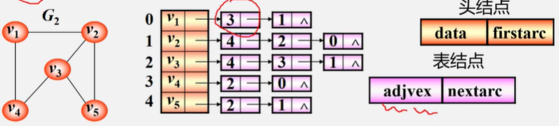

顶点

- 按编号顺序将顶点数据存储在一维数组中

  头结点：

  - data：当前顶点的值
  - firstarc：第一条弧指针

关联同一顶点的边

- 用线性链表存储

  表结点：

  - adjvex（邻接点域）：存放与vi邻接的顶点在表头数组中的位置（下标）
  - nextarc（链域）：指示下一条边或弧

#### 几种结构

1. 无向图
   - 邻接表不唯一（因为表结点的顺序可以不同）
   - 若无向图中有n个顶点、e条边，则其邻接表需n个头结点和2e个表结点。适用于存储稀疏图。
   - 无向图中顶点vi的度为第i个单链表中的结点数

2. 有向图

   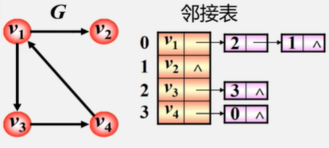

   - 顶点vi的出度为第i个单链表中的结点个数
   - 顶点vi的入度为整个单链表中邻接点域值是i-1的结点个数（因为有的话就是说有条边是往这个结点的）
   - 找出度易，找入度难

   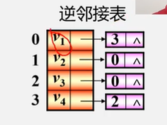

   - 顶点vi的入度为第i个单链表中的结点个数
   - 顶点vi的出度为整个单链表中邻接点域值是i-1的结点个数
   - 找入度易，找出度难

#### 邻接表存储表示

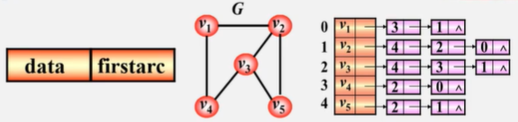

```c
//头结点
typedef struct VNode{
    VerTexType data;//顶点信息
    ArcNode *firstarc;//指向第一条依附该顶点的边的指针
}VNode,AdjList[MVNum];

//表结点
#define MVNum 100//最大顶点数
typedef struct ArcNode{//边结点
    int adjvex;//该边所指向的顶点的位置
    struct ArcNode *nextarc;//指向下一条边的指针
    OtherInfo info;//和边相关的信息
}ArcNode;

//图的结构定义
typedef struct{
    AdjList vertices;//头结点数组
    int vexnum,arcnum;//图的当前顶点数和弧数
}ALGraph;
```

#### 采用邻接表表示法创建无向网

- 输入总顶点数和总边数
- 建立顶点表
  - 依次输入点的信息存入顶点表
  - 使每个表头结点的指针域初始化为NULL
- 创建邻接表
  - 依次输入每条边依附的两个顶点
  - 确定两个顶点的序号i和j，建立边结点
  - 将此边结点分别插入vi和vj对应的两个边链表的头部

```c
Status CreateUDG(ALGraph &G){
    cin>>G.vexnum>>G.arcnum;//输入总顶点数，总边数
    for(i=0;i<G.vexnum;i++){
        cin>>G.vertices[i].data;//输入顶点值
        G.vertices[i].firstarc = NULL;//初始化表头结点的指针域
    }
    for(k=0;k<G.arcnum;k++){
        cin>>v1>>v2;//输入一条边依附的两个顶点
        i = LocateVex(G,v1);
        j = LocateVex(G,v2);
        p1 = new ArcNode;//生成一个新的边结点*p1
        p1->adjvex = j;//邻接点的序号为j
        p1->nextarc = G.vertices[i].firstarc;//头插法，将新结点*p1插入顶点vi的边表头部
        //无向网中是对称的
        p2 = new ArcNode;//生成另一个对称结点的新的边结点
        p2->adjvex = i;//邻接点序号
        p2->nextarc = G.vertices[j].firstarc;
        G.vertices[j].firstarc = p2;
    }
}
```

#### 邻接表的特点

- 方便找任一顶点的所有邻接点
- 节约稀疏图的空间
- 任一顶点的度：无向图：边结点的个数
- 不方便判断任意一对顶点间是否存在边

### 十字链表——用于有向图

把有向图的邻接表和逆邻接表结合起来

有向图的每一条弧对应十字链表中的一个弧结点

有向图中的每个顶点在十字链表中对应有一个结点

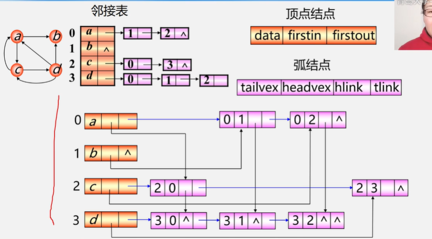

- 入度：纵向的结点个数
- 入度：横向的结点个数

#### 邻接多重表——无向图

## 图的遍历

遍历图中所有顶点且每个顶点仅被访问一次

> 如何避免重复访问
>
> 设置辅助数组visited[n]用来标记每个被访问过的顶点
>
> - 初始状态visited[i]为0
> - 顶点i被访问则置为1

### 深度优先搜索DFS

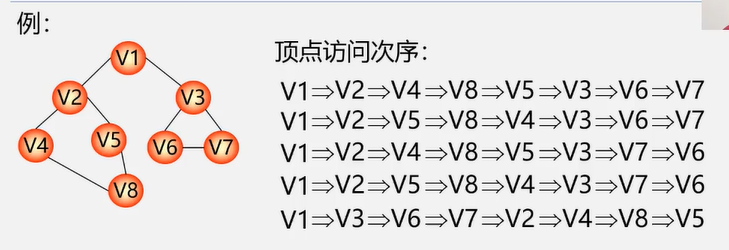

类似于树的先根遍历

#### 邻接矩阵表示的无向图深度遍历

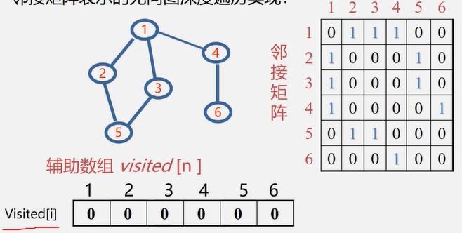

```c
void DFS(AMGraph G,int v){
    cout<<v;//访问第v个顶点
    visited[v] = true;
    for(w=0;w<G.vexnum;w++){//一vi检查邻接矩阵v所在的hang
        //w是v的邻接点，如果w未访问，则递归调用DFS
    	if((G.arcs[v][w]!=0 && (!visited[w]))){
            DFS(G,w);
        }   
    }
}
```

用邻接矩阵来表示图，遍历图中每一个顶点都要从头扫描该顶点所在行，时间复杂度为$O(n^2)$

用邻接表来表示图，虽然有2e个边结点，但只需扫描e个结点即可完成遍历，加上访问n个头结点的时间，时间复杂度为$O(n+e)$

### 广度优先搜索BFS

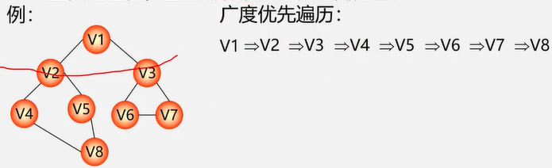

相当于树的层次遍历

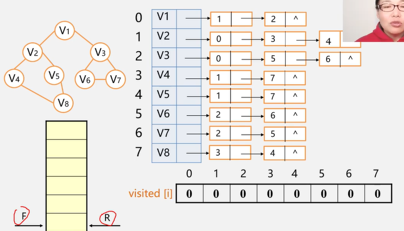

参考树的层次遍历，采用队列的方式

```c
void BFS(Graph G,int v){
    cout<<v;//访问第v个顶点
    visited[v] = true;
    InitQueue(Q);//辅助队列Q初始化，置空
    EnQueue(Q,v);//v进队
    while(!(QueueEmpty)){
        DeQueue(Q,u);//队头元素出队并置为u
        for(w=FirstAdjVex(G,u);w>=0;w=NextAdjVex(G,u,w)){//将邻接点入队
            if(!visited[w]){
                cout<<w;
                visited[w] = true;
                EnQueue(Q,w);
            }
        }
    }
}
```

如果使用邻接矩阵，则BFS对于每一个被访问到的顶点，都要循环检测矩阵中的整整一行，总的时间代价为$O(n^2)$

邻接表，同DFS

DFS和BFS空间复杂度都为O(n)。DFS采用递归，系统会使用栈，BFS使用队列，最坏的情况是顶点全在栈或队列

时间复杂度只与存储结构有关（邻接表、邻接矩阵），与搜索路径无关

## 图的应用

### 构造最小生成树

- prim

- kruskal

  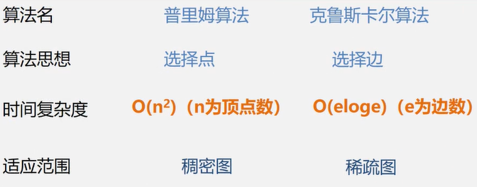

### 最短路径

- 单源最短路径——Dijkstra

  - 初始化：先找出源点v0到各终点vk的直达路径（v0，vk），即通过一条弧到达的路径
  - 选择：从这些路径中找出一条长度最短的路径（v0，u）
  - 更新：对其余各条路径进行适当调整

  任选一个顶点，看他到各顶点的距离，选一个距离最近的点x加入顶点集，再看源点到各顶点的直达距离与经过x的距离谁小；又加入一个顶点...

- 所有顶点间的最短路径——Floyd

  - 逐个顶点试探
  - 从vi到vj的所有可能存在的路径中
  - 选出一条长度最短的路径

  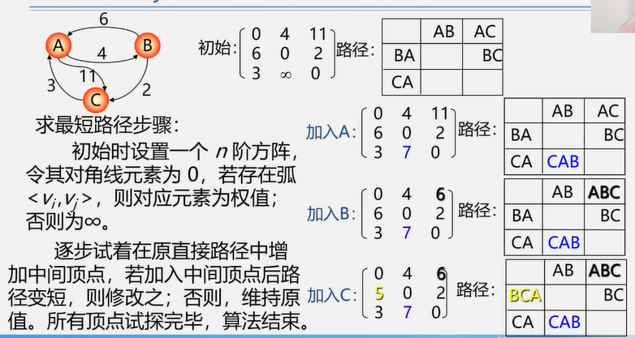

### 拓扑排序

AOV网：以顶点表示活动，弧表示活动之间的优先制约关系

AOE网：以弧表示活动，顶点表示活动的开始或结束的事件

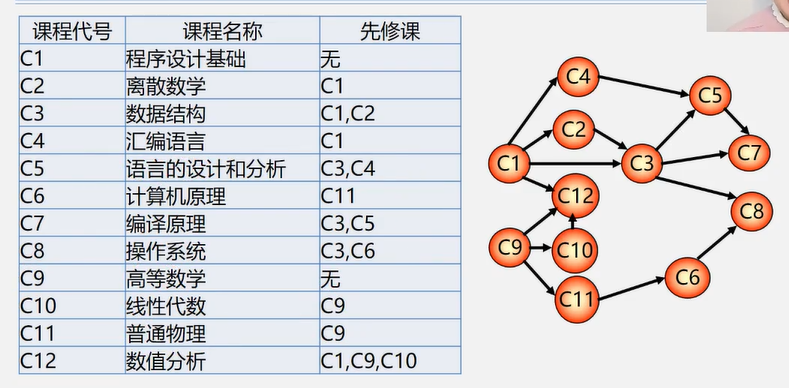

拓扑排序：

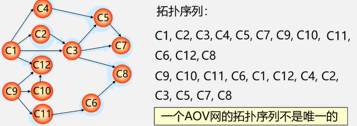

- 在有向图中选一个没有前驱的顶点且输出
- 从图中删除该顶点和所有以他为尾的弧
- 重复以上，直至全部顶点已输出

AOV网的拓扑排序是不唯一的

检测AOV网中是否存在环：对有向图构造其顶点的拓扑有序排列，若网中所有顶点都在他的拓扑排序有序序列中，则该AOV网必定不存在环

### 关键路径？？？

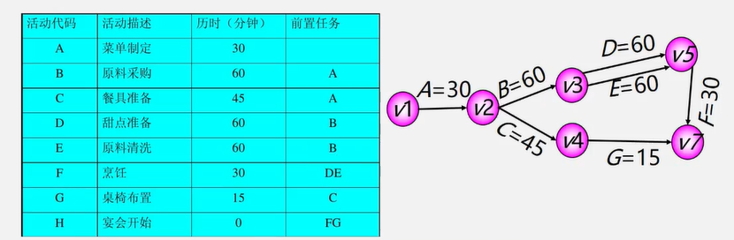

vi表示某一个时间节点：v1是0时刻，v1到v2间表示菜单定制的30分钟，然后就可以进行原料采购或者餐具准备，v3，v4同样是原料采购后或者餐具准备后的时间节点，以此类推

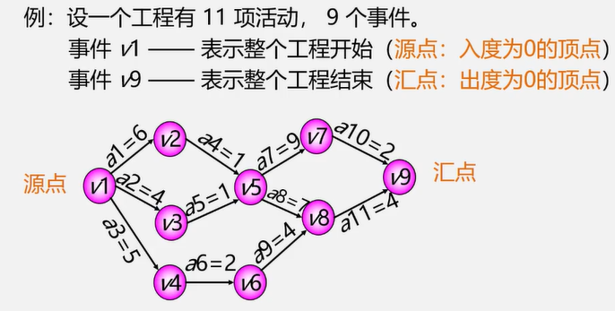

ve(vj)——表示vj的最早发生时间。如ve(v1)=0,ve(v2)=30

vl(vj)——表示vj的最迟发生时间。vl(v4)=165

e(i)——ai的最早开始时间。e(a3)=30

l(i)——活动ai的最迟开始时间。l(a3)=120

关键活动：l(i)==e(i)

