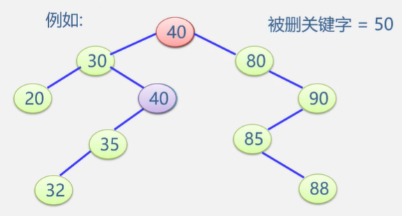

## 线性表查找

### 顺序查找

适用范围：

- 顺序表或线性链表表示的静态查找表
- 表内元素之间无序

顺序表的表示

数据元素类型定义：

```c
typedef struct{
    KeyType key;//关键字域
    ......//其他域
}ElemType;

//顺序表结构类型定义
typedef struct{
    ElemType *R;//表基地址
    int length;//表长
}SSTable;//

SSTable ST;//定义顺序表ST
```

算法


```c
int Search_Seq(SSTable ST,KeyType key){
    for(i=ST.length;i>=1;i--){
        if(ST.R[i].key == key) return i;
    }
    return 0;
}
```

**改进**

把待查关键字key存入表头（哨兵、监视哨），从后面逐个比较


如果找不到则返回0，刚好是监视哨的下标，可以免去查找过程中每一步都要检测是否查找完毕

```c
int Search_Seq(SSTable ST,KeyType key){
    ST.R[0].key = key;
    for(i=ST.length;ST.R[i].key!=key;i--){
        return i;
    }
}
```

时间复杂度O(n),空间复杂度O(1)

### 折半查找

只适合有序表，顺序存储结构

每次将待查记录所在区间缩小一半


```c
int Search_Bin(SSTable ST,KeyType key){
    low = 1;
    high = ST.length;
    while(low <= high){
        mid = (low+high)/2;
        if(ST.R[mid].key == key) return mid;
        else if(key < ST.R[mid].key){
            high = mid-1;
        }else{
            low = mid+1;
        }
        return 0;
    }
}
```

时间复杂度


**递归算法**

```c
int Search_Bin(SSTable ST,KeyType key,int low,int high){
    if(low > high){
        return 0;
    }
    mid = (low+high)/2;
    if(key == ST.elem[mid].key){
        return mid;
    }else if(key < ST.elem[mid].key){
        Search_Bin(ST,key,low,mid-1);
    }else{
        Search_Bin(ST,key,mid+1,high);
    }
}
```

**判定树**


比较几次就在第几层

查找不成功的次数=路径上的内部结点的次数


### 分块查找


- 将表分成几块，且表或者有序，或者分块有序

  若i<j，则第j块中所有记录的关键字均大于第i块中的最大关键字

- 先确定待查找记录所在块（顺序或折半），再在块内查找（顺序查找）


## 树表的查找

### 二叉排序树

- 若其左子树非空，则所子树上的所有结点均小于根结点的值
- 若其右子树非空，则右子树上所有结点均大于等于根结点的值
- 其左右子树本身又各是一棵二叉排序树

**二叉树的存储结构**

```c
typedef struct{
    KeyType key;
    InfoType otherinfo;
}ElemType;

typedef struct BSTNode{
    ElemType data;
    struct BSTNode *lchild,*rchild;
}BSTNode,*BSTree;

BSTree T;
```

**查找**

- 若查找的关键字等于根结点，成功
- 若小于根结点，查其左子树
- 若大于根结点，查其右子树

**递归查找**

```c
BSTree SearchBST(SBTree T,KeyType key){
    if(!T || key==T->data.key) return T;
    else if(key < T->data.key){
        return SearchBST(T->lchild,key);
    }else{
        return SearchBST(T->lchild,key);
    }
}
```

最好

最坏O(n)

- 比较的关键字次数=此结点所在层次数
- 最多的比较次数=树的深度

### 二叉排序树的插入

- 若二叉排序树为空，则插入结点作为根结点插入到空树中
- 否则，继续在其左右子树上查找
  - 数中已有，不再插入
  - 树中没有，查找直至某个叶子结点的左子树或右子树为空为止，则插入结点应为叶子结点的左孩子或右孩子


一个无序序列可通过构造二叉树而变成一个有序序列。构造树的过程就是对无序序列进行排序的过程。

不同插入次序的序列生成不同形态的二叉排序树


### 二叉排序树的删除

- 被删除的结点是叶子结点：直接删去该结点

- 被删除的结点只有左子树或者只有右子树，用其左子树或者右子树替换该结点。其双亲结点的相应指针域的值改为“指向被删除结点的左子树或右子树”

- 被删除的结点既有左子树又有右子树

  **方法一**

  用中序前趋之替换之，然后再删除该前驱结点。前驱是左子树中最大的结点。

  

  

  删除下方那个40的时候还是按照上边写的删除结点的方法进行

  

  **方法二**

  用后继替换之，然后在删除该后继结点。后继是右子树中最小的结点。

  将40->80，然后将右子树上的80根据上述方法删除


## 查找


### 平衡二叉树

具有以下条件的二叉排序树

- 左子树和右子树的高度之差的绝对值小于等于1
- 左子树和右子树也是平衡二叉排序树

平衡因子=结点左子树的高度-结点右子树的高度

平衡二叉树上所有结点的平衡因子只能是-1、0或1

#### 失衡二叉排序树的分析与调整

##### 失衡类型

- 失衡结点（A）

  不止一个失衡结点时，为最小失衡子树的根结点

- 插入新结点的**子树**（C）


调整原则：

- 降低高度

- 保持二叉排序树的性质

1. **LL型**

   

   - B结点带左子树α一起上升

     

   - A结点成为B的右孩子

     

   - 原来B结点的右子树β作为A的左子树

     

2. **RR型**

   

   - B结点带右子树β一起上升

     

   - A结点成为B的左孩子

     

   - 原来B结点的左子树α成为A的右子树

     

3. **LR型**

   

   - C结点穿过A、B结点上升

     

   -  B结点成为C的左孩子

     A结点成为C的右孩子

     

   - 原来C结点的左子树β作为B的右子树

     原来C结点的右子树γ作为A的左子树

     

4. **RL型**

   

   - A带左子树一起下移
   - C上移，B原来的右子树作为C的右子树
   - 新插入的结点作为A的右子树

### 散列表查找

#### 散列函数的构造方法

1. **直接定址法**

   Hash(key) = a·key + b

2. **除留余数法**

   Hash(key) = key mod p

   p不大于表长且为质数

#### 处理冲突的方法

1. **开放地址法**

   有冲突时就去寻找下一个空的散列地址，只要散列表足够大，空的散列地址总能找到，并将元素存入

   

   - 线性探测法

     d为1，2，3...线性序列

     当出现冲突时则hash(key)+1，仍然冲突就hash(key)+2，...

     

     查找22，22%11=0，在0号没有找到，在1号找到，找了2次

   - 二次探测法

     d为$1^2,-1^2,2^2,-2^2,...,q^2$二次序列

     有冲突则修改增量直到不冲突

   - 伪随机探测法

     d为伪随机数序列

2. **链地址法**

   相同散列地址的记录链成一个单链表

   m个散列地址就设m个单链表，然后用一个数组将m个单链表的表头指针存储起来，形成一个动态的结构

   

#### 散列表的查找


