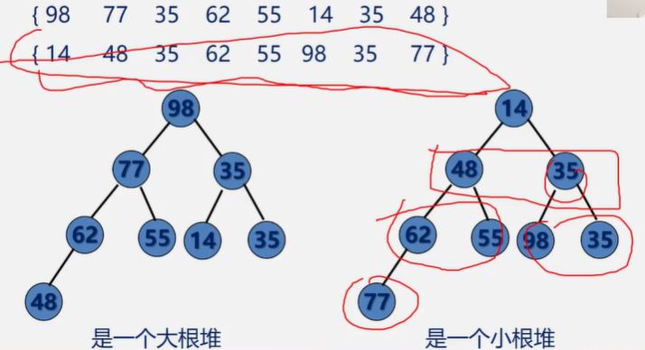

存储结构

顺序表存储

```c
#define MAXSIZE 20
typedef int KeyType;//设关键字为整型

Typedef struct{
    KeyType key;//关键字
    InfoType otherinfo;
}RedType;//记录项

Typedef struct{
    RedType r[MAXSIZE+1];//存储顺序表的向量  r[0]一般做哨兵或缓冲区
    int length;//顺序表长度
}SqList;
```

## 插入排序

每步将一个待排序的对象，按其关键码大小，插入到前面已经排好序的一组对象的适当位置上，直到对象全部插入为止

边插入边排序，保证子序列随时都是排好序的

### 直接插入排序


```c
void InsertSort(SqList &L){
    int i,j;
    for(i=2;i<=L.length;i++){
        if(L.r[i].key<L.r[i-1]){//若小于，则需调整位置
            L.r[0] = L.r[i];//将待插入元素复制为哨兵
            for(j=i-1;L.r[0].key<L.r[j].key;j--){//和待插入元素依次比较
                L.r[j+1] = L.r[j];//后移
            }
            L.r[j+1] = L.r[0];//插入位置应该为j+1，比较结束时j指向的位置在前面一个   
        }
    }
}
```

- 最好的情况：顺序有序

  比较：n-1次

  移动：0

- 最坏的情况：逆序有序

  待插入元素需要和前面每个元素比较，还需移动到最前面

   

### 折半插入排序

查找插入位置时采用折半查找


```c
void BInsertSort(SqList &L){
    for(i=2;i<=L.length;i++){
        L.r[0] = L.r[i];//当前元素存到哨兵位置
        low = 1;
        high = i-1;
        while(low <= high){
            mid = (low+high)/2;
            if(L.r[0].key < L.r[mid]){
                high = mid-1;
            }else{
                low = mid+1;
            }
        }//循环结束，插入到high+1位置（实际上是mid位置，但是mig要根据if来+1或-1）
        for(j=i-1;j>=high+1;j--){
            L.r[j+1] = L.r[j];
        }
        L.r[high+1] = L.r[0];
    }
}
```

**比较**：

它所需要的关键码比较次数与待排序对象的初始排列无关，仅依赖于对象个数。

n：待排序对象

- 当n较大时，总关键码比较次数比直接插入排序的最坏情况要好得多，但比其最好情况要差
- 在对象的初始排列已经按关键码排好序或接近有序时，直接插入排序比折半插入排序执行的关键码次数要少

**移动：**

折半插入排序的对象移动次数与直接插入排序相同，依赖于对象的初始排列

- 减少了比较次数，但没有减少移动次数
- 平均性能优于直接插入排序

时间复杂度$O(n^2)$，空间复杂度$O(1)$，稳定排序

### 希尔排序

先将整个待排序记录序列分割成若干个子序列，分别直接插入排序，待整个序列中的记录基本有序时，再对全体记录进行一次直接插入排序


先对81、35、41插入排序，然后对94、17、75，以此类推，当前间隔排序完之后->更改间隔

```c
void ShellSort(SqList &L,int dlta[],int t){
    //按增量序列dlta[]对顺序表L做希尔排序
    for(k=0;k<t;k++){
        ShellInsert(L,dlta[k]);//一趟增量为dlta[k]的插入排序
    }
}
//其中某一趟的排序操作
//对顺序表L进行一趟增量为dk的shell排序，dk为步长因子
void ShellInsert(SqList &L,int dk){
    for(i=dk+1;i<=L.length;i++){//依次排序所有子序列
        if(r[i].key < r[i-dk].key){//如果小于 才移动，否则说明当前子序列前面的元素已经排好序
            r[0] = r[i];//较大的数要后移，先暂存小的值
            for(j=i-dk;j>0&&r[0].key<r[j].key;j=j-dk){//依次和已排好序的元素比较，找到合适的插入位置
                r[j+dk] = r[j];//后移
            }
            r[j+dk] = r[0];//插入
        }
    }
}
```

算法效率与增量序列的取值有关

不稳定的排序算法

空间复杂度$O(1)$

## 交换排序

两两比较，如果发生逆序则交换，直到所有记录排好序为止

### 冒泡排序

每趟不断将记录两两交换

```c
void bubble_sort(SqList &L){
    int m,i,j;
    RedType x;
    for(m=1;m<=n-1;m++){//共需要n-1趟
        for(j=1;j<=n-m;j++){
            if(L.r[j].key > L.r[j+1].key){
                //交换
                x = L.r[j];
                L.r[j] = L.r[j+1];
                L.r[j+1] = x;
            }
        }
    }
}
```

**改进**

```c
void bubble_sort(SqList &L){
    int m,i,j;
    RedType x;
    int flag;//作为知否有交换的标记
    for(m=1;m<=n-1&&flag==1;m++){//共需要n-1趟
        flag = 0;
        for(j=1;j<=n-m;j++){
            if(L.r[j].key > L.r[j+1].key){
                flag = 1;//发生交换.未发生交换后，说明已经有序,后面几趟可以省略
                //交换
                x = L.r[j];
                L.r[j] = L.r[j+1];
                L.r[j+1] = x;
            }
        }
    }
}
```

时间复杂度：$O(n^2)$,空间复杂度：$O(1)$,稳定排序

### 快速排序——改进的交换排序

- 任取一个元素为中心
- 所有比它小的元素一律前放，比他大的后放 ，形成左右两个子表
- 对各子表重新选择中心元素并依次规则调整
- 直到每个子表的元素只剩一个

```c
//0号位置用来存放选定的中心值，所有中心值的位置就空出来了，从最后面选一个小于中心值的数放在中心值处，后面就空出来了，又从前面找一个大的放后面
void QSort(SqList &L,int low,int high){
    if(low < high){//low==high表示元素放完了
        pivotloc = Parition(L,low,high);//将L.r一分为二，pivotloc为枢轴元素排好序的位置
        QSort(L,low,pivotloc-1);
        QSort(L,pivotloc+1,high);
    }
}

int Partition(SqList &L,int low,int high){
    L.r[0] = L.r[row];//选定中心点
    pivotkey = L.row[low].key;
    while(low < high){
        //将后面较小的值往前放
        while(low<high && L.r[high].key>=pivotkey){
            high--;
        }
        L.r[low] = L.r[high];
        //将前面较大的值往后放
        while(low<high && L.r[low].key<=pivotkey){
            low++;
        }
        L.r[high] = L.r[row];
    }
    //low==high,所有元素都放完了，剩下的这个位置就是中心点的位置
    L.r[low] = L.r[0];
    return low;
}

QSort(L,1,L.length);
```

时间复杂度：

空间复杂度：，用到了递归

不稳定排序

不适用于对原本有序或基本有序的记录进行排序

划分元素的选取是影响时间性能的关键，输入数据次序越乱随机性越好则排序速度越快

## 选择排序

### 简单选择排序


```c
void SelectSort(SqList &K){
    for(i=1;i<L.length;j++){
        k = i;
        for(j=i+1;j<=L.length;j++){
            if(L.r[j].key < L.r[k].key){
                k = j;//记录最小值位置
            }
        }
        if(k != i){
            L.r[i]<-->L.r[k];//交换
        }
    }
}
```

时间复杂度：$O(n^2)$

不稳定排序

### 堆排序

小根堆：完全二叉树，每个非叶子结点都小于左右孩子



若在输出堆顶的最值后，是的剩余n-1个元素的序列重新又建成一个堆，根又是最值

**堆的调整**

小根堆

- 输出根并以最后一个元素代替之

- 比较其左右孩子值的大小，并与其中较小者交换

  

```c
void HeapAdjust(elem R[],int s,int m){
    rc = R[s];
    //已知R[s..]中记录的关键字除R[s]之外均满足堆的定义，本函数调整R[s]的关键字，使R[s.m]成为一个大根堆
    for(j=2*s;j<=m;j*=2){//沿key较大的孩子结点向下筛选
        if(j<m && R[j]<R[j+1]) j++;//j为key较大的记录的下标
        if(rc >= R[j]) break;
        R[s] = R[j] s = j;//rc插入在位置s上
    }
    R[s] = rc;
}
```

**建立堆**


```c
void HeapSort(lem R[]){
    int i;
    for(i=n/2;i>=1;i--){
        HeapAdjust(R,i,n);
    }
    for(i=n;i>1;i--){
        Swap(R[1],R[i]);//根与最后一个元素交换
        HeapAdjust(R,1,i-1);//重新建立堆
    }
}
```


## 归并排序

二路归并


两个序列的归并参考前面的有序序列合并

## 基数排序


## 比较

